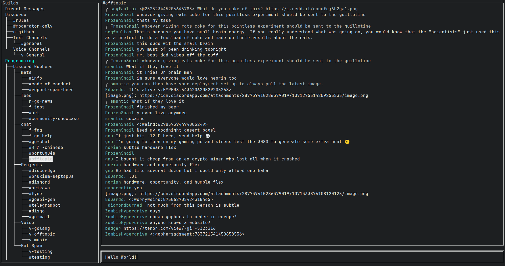

# discordo &middot; [](https://github.com/ayntgl/discordo/actions/workflows/build.yml) [](https://github.com/ayntgl/discordo/blob/master/LICENSE) [](https://goreportcard.com/report/github.com/ayntgl/discordo)

Discordo is a lightweight, secure, and feature-rich Discord terminal client.



## Features

- Lightweight
- Secure
- Configurable
- Cross-platform
- Minimalistic
- Feature-rich
  - Mouse & clipboard support
  - 2-Factor authentication
  - Desktop notifications
  - Partial [Discord-flavored markdown](https://support.discord.com/hc/en-us/articles/210298617-Markdown-Text-101-Chat-Formatting-Bold-Italic-Underline-)

## Installation

### Building from source

```bash
git clone https://github.com/ayntgl/discordo
cd discordo
go build

# optional
sudo mv ./discordo /usr/local/bin
```

### Package managers

- Arch Linux (unofficial, AUR, may be outdated): `yay -S discordo-git`

## Usage

1. Run the `discordo` executable with no arguments in a new Terminal window.
2. Log in using the account email and password (first-time login) and click on the "Login" button to continue.

> By default, Discordo utilizes OS-specific keyring to store credentials such as client authentication token. However, if you prefer not to use a keyring, you may set the `token` field in the configuration file (`~/.config/discordo/config.json`) and Discordo will prioritize the usage of `Token` field to login instead of keyring.

### Configuration

Discordo aims to be highly configurable, it may be easily customized via a configuration file. It creates a default configuration file on the first start-up. The default and newly created configuration file is located at `$HOME/.config/discordo/config.json`. Here is a sample (not default) configuration file:

```json
{
  // The client authentication token (optional)
  "Token": "",
  // Enables mouse support.
  "Mouse": true,
  // Enables OS-specific desktop notifications when the client user is mentioned in non-selected channels.
  "Notifications": true,
  // Set a custom user agent for all of the HTTP requests.
  "UserAgent": "Mozilla/5.0 (X11; Linux x86_64) AppleWebKit/537.36 (KHTML, like Gecko) Chrome/92.0.4515.131 Safari/537.36",
  // Set the number of messages to retrieve when a text-based channel is selected.
  "GetMessagesLimit": 30,
  // The Theme field values can be hex color codes (#f44f36) or W3C color names.
  "Theme": {
    "PrimitiveBackgroundColor": "black",
    "ContrastBackgroundColor": "blue",
    "MoreContrastBackgroundColor": "green",
    "BorderColor": "white",
    "TitleColor": "white",
    "GraphicsColor": "white",
    "PrimaryTextColor": "white",
    "SecondaryTextColor": "yellow",
    "TertiaryTextColor": "green",
    "InverseTextColor": "blue",
    "ContrastSecondaryTextColor": "darkcyan"
  },
  "Keybindings": {
    "GuildsTreeViewFocus": "Alt+Rune[1]",
    "MessagesTextViewFocus": "Alt+Rune[2]",
    "MessagesTextViewSelectPrevious": "Up",
    "MessagesTextViewSelectNext": "Down",
    "MessagesTextViewSelectFirst": "Home",
    "MessagesTextViewSelectLast": "End",
    "MessagesTextViewReplySelected": "Rune[r]",
    "MessagesTextViewMentionReplySelected": "Rune[R]",
    "MessageInputFieldFocus": "Alt+Rune[3]"
  }
}
```

### Clipboard support

On Linux, clipboard support requires:

- `xclip` or `xsel` for X11.
- `wl-clipboard` for Wayland.

## Disclaimer

Automated user accounts or "self-bots" are against Discord's Terms of Service. I am not responsible for any loss caused by using "self-bots" or Discordo.
